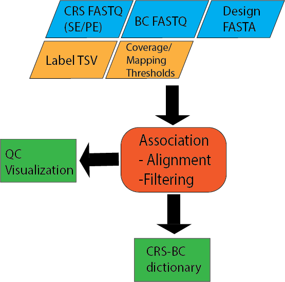

.. _Association:

=====================
Association
=====================

Input files
===============

Fastq Files
-----------
2-3 Fastq files from library association sequencing
--Candidate regulatory sequence (CRS) sequencing, 1 forawrd read and an optional reverse read if paired end sequencing was used
--Barcode sequence, 1 read covering the barcode

Design File
-----------
Fasta file of of CRS sequences with unique headers describing each tested sequence

Example file:

.. code-block:: text

    >CRS1
    GACGGGAACGTTTGAGCGAGATCGAGGATAGGAGGAGCGGA
    >CRS2
    GGGCTCTCTTATATTAAGGGGGTGTGTGAACGCTCGCGATT
    >CRS3
    GGCGCGCTTTTTCGAAGAAACCCGCCGGAGAATATAAGGGA
    >CRS4
    TTAGACCGCCCTTTACCCCGAGAAAACTCAGCTACACACTC

Label File (Optional)
---------------------
Tab separated file (TSV) of desired labels for each tested sequence

Example file:

.. code-block:: text

    CRS1  Positive_Control
    CRS2  Negative_Control
    CRS3  Test
    CRS4  Positive_Control

.. Variant File (Optional)
    -----------------------
    For libraries of test sequences with single nucleotide variants (SNVs), a TSV of locations and base pair changes in each CRS

.. Example file
    reference_name  variant_positions ref_bases alt_bases
    ref1  130 A T
    ref2  108 G A
    ref3 67,99 A,C C,T

association.nf
============================

Options
---------------

With :code:`--help` or :code:`--h` you can see the help message.

**Mandatory arguments:**
  --fastq-insert                Full path to library association fastq for insert (must be surrounded with quotes)
  --fastq-bc                    Full path to library association fastq for bc (must be surrounded with quotes)
  --design                      Full path to fasta of ordered oligo sequences (must be surrounded with quotes)
  --name                        Name of the association. Files will be named after this.

**Optional:**
  --fastq-insertPE              Full path to library association fastq for read2 if the library is paired end (must be surrounded with quotes)
  --min-cov                     minimum coverage of bc to count it (default 3)
  --min-frac                    minimum fraction of bc map to single insert (default 0.5)
  --mapq                        map quality (default 30)
  --baseq                       base quality (default 30)
  --cigar                       require exact match ex: 200M (default none)
  --outdir                      The output directory where the results will be saved and what will be used as a prefix (default outs)
  --split                       Number read entries per fastq chunk for faster processing (default: 2000000)
  --labels                      tsv with the oligo pool fasta and a group label (ex: positive_control) if no labels desired a file will be automatically generated

.. --variants                    tsv with reference_name variant_positions ref_bases alt_bases, only input for variant analyses workflow

Processes
-------------

Processes run by nextflow in the Association Utility. Some Processes will be run only if certain options used and are marked below.

count_bc or count_bc_nolab (if no label file is provided)
  Removes any illegal characters (defined by Piccard) in the label file and design file. Counts the number of reads in the fastq file.

create_BWA_ref
  Creates a BWA reference based on the design file

PE_merge (if paired end fastq files provided)
  Merges the forward and reverse reads covering the CRS using fastq-join

align_BWA_PE or align_BWA_S (if single end mode)
  Uses BWA to align the CRS fastq files to the reference created from the Design File. This will be done for each fastq file chunk based on the split option.

collect_chunks
  merges all bamfiles from each separate alignment

map_element_barcodes
  Assign barcodes to CRS and filters barcodes by user defined parameters for coverage and mapping percentage

filter_barcodes
  Visualize results

Output
==========

The output can be found in the folder defined by the option :code:`--outdir`. It is structured in folders of the condition as

Files
-------------

count_fastq.txt
    number of barcode reads
count_merged.txt
    number of aligned CRS reads
design_rmIllegalChars.fa
    Design file with illegal characters removed
label_rmIllegalChars.txt
    Label file with illegal characters removed
s_merged.bam
    sorted bamfile for CRS alignment
${name}_coords_to_barcodes.pickle
    pickle file containing a python dictionary of CRS/barcode mappings
\*.png
    Visualization of number of barcodes mapping to enhancers
