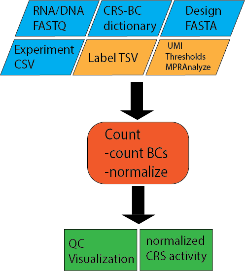

.. _Count:

=====================
Count
=====================

Input files
===============

Experiment File
---------------
Comma separated file (CSV) that assigns all fastq files present in a directory to a condidtion and replicate. Each line represents an experiment, which will all be processed in parallel

.. code-block:: text

    Condition,Replicate,DNA_BC_F,DNA_UMI,DNA_BC_R,RNA_BC_F,RNA_UMI,RNA_BC_R
    Condidtion1,1,C1R1_DNA_barcode_F.fastq.gz,C1R1_DNA_barcode_UMI.fastq.gz,C1R1_DNA_barcode_R.fastq.gz,C1R1_RNA_barcode_F.fastq.gz,C1R1_RNA_barcode_UMI.fastq.gz,C1R1_RNA_barcode_R.fastq.gz
    Condidtion1,2,C1R2_DNA_barcode_F.fastq.gz,C1R2_DNA_barcode_UMI.fastq.gz,C1R2_DNA_barcode_R.fastq.gz,C1R2_RNA_barcode_F.fastq.gz,C1R2_RNA_barcode_UMI.fastq.gz,C1R2_RNA_barcode_R.fastq.gz
    Condidtion1,3,C1R3_DNA_barcode_F.fastq.gz,C1R3_DNA_barcode_UMI.fastq.gz,C1R3_DNA_barcode_R.fastq.gz,C1R3_RNA_barcode_F.fastq.gz,C1R3_RNA_barcode_UMI.fastq.gz,C1R3_RNA_barcode_R.fastq.gz
    Condidtion2,1,C2R1_DNA_barcode_F.fastq.gz,C2R1_DNA_barcode_UMI.fastq.gz,C2R1_DNA_barcode_R.fastq.gz,C2R1_RNA_barcode_F.fastq.gz,C2R1_RNA_barcode_UMI.fastq.gz,C2R1_RNA_barcode_R.fastq.gz
    Condidtion2,2,C2R2_DNA_barcode_F.fastq.gz,C2R2_DNA_barcode_UMI.fastq.gz,C2R2_DNA_barcode_R.fastq.gz,C2R2_RNA_barcode_F.fastq.gz,C2R2_RNA_barcode_UMI.fastq.gz,C2R2_RNA_barcode_R.fastq.gz
    Condidtion2,3,C2R3_DNA_barcode_F.fastq.gz,C2R3_DNA_barcode_UMI.fastq.gz,C2R3_DNA_barcode_R.fastq.gz,C2R3_RNA_barcode_F.fastq.gz,C2R3_RNA_barcode_UMI.fastq.gz,C2R3_RNA_barcode_R.fastq.gz

Design File
-----------
Fasta file of of CRS sequences with unique headers describing each tested sequence

Example file:

.. code-block:: text

    >CRS1
    GACGGGAACGTTTGAGCGAGATCGAGGATAGGAGGAGCGGA
    >CRS2
    GGGCTCTCTTATATTAAGGGGGTGTGTGAACGCTCGCGATT
    >CRS3
    GGCGCGCTTTTTCGAAGAAACCCGCCGGAGAATATAAGGGA
    >CRS4
    TTAGACCGCCCTTTACCCCGAGAAAACTCAGCTACACACTC
    
Association Pickle
------------------
Python dictionary of CRS to Barcodes

Label File (Optional)
---------------------
Tab separated file (TSV) of desired labels for each tested sequence

Example file:

.. code-block:: text

    CRS1  Positive_Control
    CRS2  Negative_Control
    CRS3  Test
    CRS4  Positive_Control

Count.nf
============================
 
Options
---------------

With :code:`--help` or :code:`--h` you can see the help message.

**Mandatory arguments:**
  --dir                         Fasta directory (must be surrounded with quotes)
  --e, --experiment-file        Experiment csv file
  --design                      Fasta of ordered insert sequences.
  --association                 Pickle dictionary from library association process.
 
**Optional:**
  --labels                      tsv with the oligo pool fasta and a group label (ex: positive_control), a single label will be applied if a file is not specified
  --outdir                      The output directory where the results will be saved (default outs)
  --bc-length                   Barcode length (default 15)
  --umi-length                  UMI length (default 10)
  --no-umi                      Use this flag if no UMI is present in the experiment (default with UMI)
  --merge_intersect             Only retain barcodes in RNA and DNA fraction (TRUE/FALSE, default: FALSE)
  --mpranalyze                  Only generate MPRAnalyze outputs
  --thresh                      minimum number of observed barcodes to retain insert (default 10)

Processes
-------------

Processes run by nextflow in the Association Utility. Some Processes will be run only if certain options used and are marked below.

create_BAM or create_BAM_noUMI (if no UMI sequence)
  creates a bamfile of barcode and UMI sequences

raw_counts
  creates a table of counts for each barcode (where UMIs, if present, are deduplicated)
  
filter_counts
  Remove barcodes that are not the appropriate length

final_counts
  Record overrepresended UMIs and final count table

dna_rna_merge_counts or dna_rna_mpranalyze_merge
  Merge RNA/DNA count matrices per barcode

final_merge (MPRAnalyze option only)
  Merge all DNA/RNA counts into one file
  
final_label (MPRAnalyze option only)
  Label the barcodes 
  
generate_mpranalyze_inputs (MPRAnalyze option only)
  Generate inputs for MPRAnalyze, counts tables and annotation tables for rna/dna 
  
dna_rna_merge
  Merge each DNA and RNA file label with sequence and insert and normalize
  
calc_correlations
  Calculate correlations between Replicates
  
make_master_tables
  Create tables of each CRS normalized across replicates

  
Output
==========

The output can be found in the folder defined by the option :code:`--outdir`. It is structured in folders of the condition as

Files
-------------

File tree

.. code-block:: text

    outdir
      |-Condition
        |-allreps.tsv
        |-average_allreps.tsv
        |-HepG2_1_2_correlation.txt
        |-HepG2_1_2_DNA_pairwise.png
        |-HepG2_1_2_Ratio_pairwise.png
        |-HepG2_1_2_RNA_pairwise.png
        |-HepG2_all_barcodesPerInsert_box.png
        |-HepG2_barcodesPerInsert.png
            |-Reps
                |-HepG2_1_counts.tsv
                |-HepG2_1_counts.tsv.gz
                |-HepG2_1_DNA_counts.tsv
                |-HepG2_1_DNA_raw_counts.tsv.gz  
                |-HepG2_1_RNA_filtered_counts.tsv.gz
                |-HepG2_1_DNA_filtered_counts.tsv.gz
                |-HepG2_1_RNA_counts.tsv
                |-HepG2_1_RNA_raw_counts.tsv.gz

Files for each Condition
------------------------
allreps.tsv
  TSV of normalized DNA and RNA count, ratio, log2ratio, and number of observed barcodes for each condition, replicate, of every CRS
average_allreps.tsv
  mean ratio, log2 ratio, and observed barcodes per condidition normalized for all replicates
HepG2_1_2_correlation.txt
  correlation values for a condition and 2 replicates (ie: HepG2 replicate 1 vs replicate 2)
HepG2_1_2_DNA_pairwise.png
  Correlation plot of DNA counts condition vs two reps (ie: HepG2 replicate 1 vs replicate 2)
HepG2_1_2_Ratio_pairwise.png
  Correlation plot of normalized log2(RNA/DNA) condition vs two reps (ie: HepG2 replicate 1 vs replicate 2)
HepG2_1_2_RNA_pairwise.png
  Correlation plot of RNA counts condition vs two reps (ie: HepG2 replicate 1 vs replicate 2)
HepG2_all_barcodesPerInsert_box.png
  Box plot of each CRS accross replicates for all barcodes in each condidtion. Colored by the label file.
HepG2_barcodesPerInsert.png
  Histogram of number of barcodes detected per CRS
HepG2_group_barcodesPerInsert_box.png
  Boxplot of CRS normalized per insert, grouped by labels

Files for each replicate in each condidtion
-------------------------------------------
HepG2_1_counts.tsv  
  mean ratio, log2 ratio, and observed barcodes per condidition for each replicate
HepG2_1_counts.tsv.gz
  table of barcodes with DNA counts and RNA counts
HepG2_1_DNA_counts.tsv              
  table of barcodes with DNA counts
HepG2_1_DNA_raw_counts.tsv.gz  
  table of barcodes, UMI, and DNA counts raw
HepG2_1_DNA_filtered_counts.tsv.gz  
  table of barcodes, UMI, and DNA counts raw, filtered for barcodes of correct length
HepG2_1_RNA_counts.tsv
  table of barcodes with RNA counts
HepG2_1_RNA_raw_counts.tsv.gz
  table of barcodes, UMI, and RNA counts raw
HepG2_1_RNA_filtered_counts.tsv.gz
  table of barcodes, UMI, and DNA counts raw, filtered for barcodes of correct length
