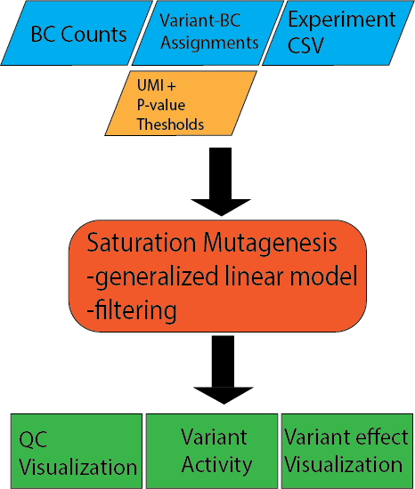

.. _Saturation mutagenesis:

================================
Saturation mutagenesis
================================

Input files
===============

Variant-BC Assignments
-----------------------------

The assignment file contains the variants, assigned to each barcode. It can be gzipped and it is set through the option :code:`--assignment`. Each row starts with one barcode, e.g. :code:`AAAAAACTAATACCA`. The barcode is followed by multiple variants separated by a space. It can also be possible that a barcode has no variant. Then the barcode stands for the complete reference sequence. A variant has the format :code:`identifier:position:ref>alt`, e.g. :code:`TERT:408:G>A`. The `identifier` will be always the same and is use to mark the target of origin. Here the promoter TERT. The `position` is usually the position in the target transcript or any other coordinate system. `ref` is the reference base and `alt` the alternative base to the original target reference. Both can be a single or multiple nucleotide, e.g. :code:`TERT:75:GCCCC>GCCCCC` is a valid variant and refers to an insertion of one C after position 79. For deletions a dot (:code:`.`) can be used in the reference. So :code:`TERT:42:G>.` is the deletion of the base G at position 42. It can also be written as :code:`TERT:41:TG>T`.

Example file:

.. code-block:: text

    AAAAAACTAATACCA	IRF6:104:A>G IRF6:408:G>A
    AAAAAAGCAGGAACA	IRF6:66:A>G IRF6:373:T>A
    AAAAAAGCATTCTGT	IRF6:371:G>T IRF6:510:G>A IRF6:560:C>T
    AAAAACACTACTGGT	IRF6:326:C>T IRF6:509:T>A

Experiment file
---------------------

Experiment file list the condition(s), replicate(s) and corresponding count files of the analysis. It is comma separated (without spaces in between) and must be set via :code:`--e` or :code:`--experiment-file`.

.. code-block:: text

    TERT-GBM,1,TERT-GBM_1_counts.tsv.gz
    TERT-GBM,2,TERT-GBM_2_counts.tsv.gz
    TERT-GBM,3,TERT-GBM_3_counts.tsv.gz
    TERT-HEK,1,TERT-HEK_1_counts.tsv.gz
    TERT-HEK,2,TERT-HEK_2_counts.tsv.gz
    TERT-HEK,3,TERT-HEK_3_counts.tsv.gz

DNA/RNA counts per barcode
-------------------------------

For each condition and replicate count file (gziped) is needed with the number of DNA and RNA counts per barcode. It is tab separated starting with the barcode, followed by the the DNA and then the RNA counts. Count files can be produced by the count workflow. See :ref:`Count`. All count files must be in the :code:`--dir` folder.

Example file:

.. code-block:: text

    AAAAAAAAAATGATAAGGAA    56      29
    AAAAAAAAAATGGGAAGGCG    89      112
    AAAAAAAAAATTTGCGTAAA    25      32
    AAAAAAAAAATTTGCGTAAT    1       1
    AAAAAAAAAATTTGGGGATA    5       26
    AAAAAAAAACAATAAGAAAT    21      55
    AAAAAAAAACCCAGAATACG    31      39

SaturationMutagenesis.nf
============================

Options
---------------

With :code:`--help` or :code:`--h` you can see the help message.

**Mandatory arguments:**

  --dir                         Directory of count files (must be surrounded with quotes).
  --assignment                  Variant assignment file.
  --e, --experiment-file        Experiment csv file.

**Optional:**

  --outdir                      The output directory where the results will be saved (default outs).
  --thresh                      Minimum number of observed barcodes to retain variant (default 10).
  --pvalue                      pValue cutoff for significant different variant effects. For variant effect plots only (default 1e-5).

Processes
-------------

Processes run by nextflow in the saturation mutagenesis utility.

calc_assign_variantMatrix
  Creates the variant matrix for the linear model using only single base pair substitutions (for each condition and replicate).
calc_assign_variantMatrixWith1bpDel
  Creates the variant matrix for the linear model using single base pair substitutions and 1 bp deletions (for each condition and replicate).
fitModel
  Fit the matrix (variantMatrix and variantMatrixWith1bpDel) using a generalized linear model (for each condition and replicate).
summarizeVariantMatrix
  .. todo:: describe summarizeVariantMatrix
statsWithCoefficient
  Output of the log2 variant effects from the linear model combined with number of barcodes (for each condition and replicate).
plotCorrelation
  Plots the correlation between replicates of one condition.
plotStatsWithCoefficient
  Plots the variant effect plot of the target region using all variants larger than the threshold and the significnace level set by :code:`--p-value` (for each condition and replicate).
fitModelCombined
  Fit the matrix (variantMatrix and variantMatrixWith1bpDel) using a generalized linear model (for each condition the combined model).
combinedStats
  .. todo:: describe combinedStats
statsWithCoefficientCombined
  Output of the log2 variant effects from the linear model combined with number of barcodes (for each condition the combined model).
plotStatsWithCoefficientCombined
  Plots the variant effect plot of the target region using all variants larger than the threshold and the significnace level set by :code:`--p-value` (for each condition the combined model).

Output
==========

The output can be found in the folder defined by the option :code:`--outdir`. It is structured in folders of the condition as

Files
-------------

.. todo:: Describe SatMut output files
